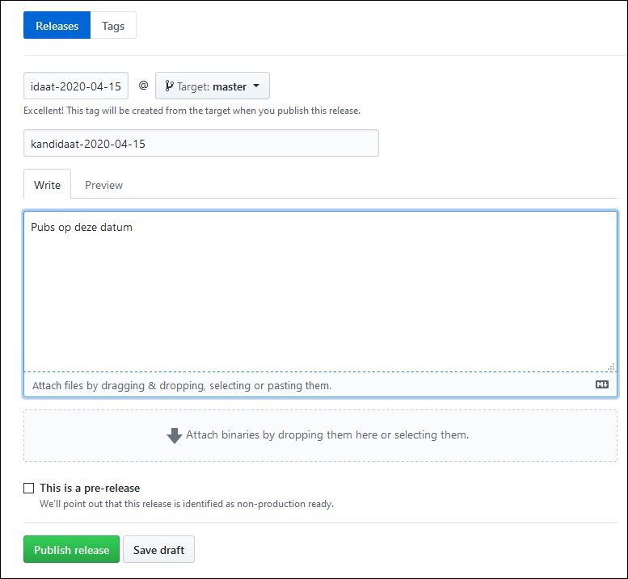

# Git en Github handelingen

***Dit is geen [Git handleiding](https://git-scm.com/docs) of [Github handleiding](https://guides.github.com/introduction/git-handbook),
maar gewoon een lijst individuele Git(hub) handelingen die soms nodig zijn of verdere toelichting vragen in OSLO-verband.***

[Editors: verander de titels van de topics niet; er wordt naar doorverwezen van op andere pagina's]

## Een release maken op Github

We onderscheiden 3 gevallen:
1. Vanaf de laatste commit op een branch
2. Vanaf een specifieke recente commit
3. Vanaf een specifieke oudere commit **(vooral hier is toelichting nodig)**

### Een release maken op Github vanaf de laatste commit op een branch

De eenvoudigste situatie...

1. Surf naar de repo op github.

1. Klik op de tab **Releases**.

1. Klik op de knop **Draft a new release** (of **Create a new release** als er nog geen eerdere releases zijn).

1. Geef een waarde (volgens afgesproken naamgeving) in het veld **Tag version**; dit wordt de *tag* die zal gemaakt worden.

1. Open de drop down rechts van het **@** teken en kies de gewenste *branch* uit het linker tabblad.

1. Herhaal bij voorkeur gewoon de *tag* in het veld **Release title**.

1. Geef eventueel een korte beschrijving.

1. Werk af met de **Publish release** knop.

Voorbeeld:




### Een release maken op Github vanaf een specifieke recente commit

Oei, je bent te laat voor de eenvoudigste situatie...

1. Surf naar de repo op github.

1. Klik op de tab **Releases**.

1. Klik op de knop **Draft a new release** (of **Create a new release** als er nog geen eerdere releases zijn).

1. Geef een waarde (volgens afgesproken naamgeving) in het veld **Tag version**; dit wordt de *tag* die zal gemaakt worden.

1. Open de drop down rechts van het **@** teken en kies de gewenste *recent commit* uit het rechter tabblad. De getoonde hashes zijn afgekort (bijvoorbeeld `baa7ad7`).

1. Herhaal bij voorkeur gewoon de *tag* in het veld **Release title**.

1. Geef eventueel een korte beschrijving.

1. Werk af met de **Publish release** knop.


### Een release maken op Github vanaf een specifieke oudere commit

Oei², je bent zelfs te laat voor de vorige situatie: de commit staat niet meer in de lijst van recente commits!

1. Open een command shell waarin de git command line beschikbaar is (Git Bash in Windows...).

1. Maak een clone van de repo en ga naar de directory waarin de clone staat:
    ````
    git clone <repo>
    cd <repo-dir>
    ````

1. Maak een annotated tag:
    ```
    git tag -a <tag> -m 'tag commentaar' <commit>
    ```
    Bijvoorbeeld:
    ```
    git tag -a ontwerp-2019-08-17 -m 'publicatie eerste versie AP' 7c2704b3e6b1f7cbe33f8152f40af6156cbddee2
    ```
 
1. Duw de tag(s) terug naar de repo:    
    ```
    git push --tags
    ```

1. Surf naar de repo op github.

1. Klik op de tab **Releases**.

1. Klik op de knop **Draft a new release** (of **Create a new release** als er nog geen eerdere releases zijn).

1. Plak de met `git tag` aangemaakte tag in het veld **Tag version**. De gebruikersinterface toont een drop-down list met één element (de tag). Bevestig.
De gebruikersinterface bevestigt dat dit een bestaande tag is en het **@** teken met de keuzeknop rechts ervan verdwijnt.

1. Herhaal bij voorkeur gewoon de *tag* in het veld **Release title**.

1. Geef eventueel een korte beschrijving.

1. Werk af met de **Publish release** knop.

