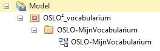
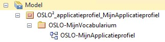

# Initiële bestanden in een thema repository

Een thema repository bevat initieel een structuur van directories en bestanden op de master branch.
Deze zijn overgenomen uit een template repository.

Principe: _pas bestandsnamen en bestandsinhoud aan uw situatie aan. Voeg bestanden toe waar nodig._

Als hint is elk variabel gegeven in de initiële bestandsnamen en bestandsinhoud aangeduid met het woord `mijn` of `Mijn` (al naargelang de voorgestelde hoofdletter / kleine letter voorkeur).
Je kan bijvoorbeeld nu meteen de titel van het README.md bestand in de repository root aanpassen (er staat voorlopig `OSLOthema-mijnThema`).

## Overzicht initiële bestanden

```
.
├── CHANGELOG
├── README.md
├── stakeholders.csv
├── OSLO-MijnVocabularium-VOC.eap
├── OSLO-MijnApplicatieprofiel-AP.eap
├── config
│   ├── mijn-vocabularium-voc.json
│   └── mijn-applicatieprofiel-ap.json
├── resources
├── site-skeleton
│   └── mijn-applicatieprofiel-ap
│       └── overview.jpg
└── templates
    ├── mijn-vocabularium-voc.j2
    └── mijn-applicatieprofiel-ap.j2
```

| Initieel bestand (of directory) | Beschrijving |
|---------------------------------|--------------|
| CHANGELOG | Overzicht van wijzigingen. Vul aan volgens voorbeeld, op de master branch. |
| README.md | Wat bezoekers van de github repository op de frontpagina te zien krijgen. Vul aan volgens voorbeeld, op de master branch. |
| stakeholders.csv | Lijst met Auteurs, Editors en Medewerkers. Vul aan volgens voorbeeld. **Opgepast voor speciale karakters: bestand moet UTF-8 encoded zijn.** |
| OSLO-MijnVocabularium-VOC.eap | Enterprise Architect bestand voor een vocabularium. Zie *Enterprise Architect bestanden* lager. |
| OSLO-MijnApplicatieprofiel-AP.eap | Enterprise Architect bestand voor een applicatieprofiel. Zie *Enterprise Architect bestanden* lager. |
| config/mijn-vocabularium-voc.json | Configuratiebestand voor een vocabularium. Pas inhoud aan in lijn met voorbeeld. |
| config/mijn-applicatieprofiel-ap.json | Configuratiebestand voor een applicatieprofiel. Pas inhoud aan in lijn met voorbeeld. |
| resources | Directory voor allerlei resources. Voeg in een vrije structuur hier bestanden toe die nuttig zijn voor of aan bod komen tijdens de thematische werkgroepen. |
| site-skeleton/mijn-applicatieprofiel-ap/overview.jpg | Diagram voor het applicatieprofiel. JPEG bestand bekomen via copy/paste uit het diagram in het overeenkomstig Enterprise Architect bestand. |
| templates/mijn-vocabularium-voc.j2 | Template bestand voor het tekstgedeelte van de specificatie van een vocabularium. Vul aan.|
| templates/mijn-applicatieprofiel-ap.j2 | Template bestand voor het tekstgedeelte van de specificatie van een applicatieprofiel. Vul aan. |

## Enterprise Architect bestanden

In de initiële bestanden wordt een afzonderlijk Enterprise Architect (EA) bestand voorgesteld voor een vocabularium en een applicatieprofiel.

Dit laat de meest flexibele ontwikkeling van een vocabularium toe, volledig los van een applicatieprofiel.

Bovendien vermijdt dit de ten onrecht beschadiging van een vocabularium omwille van beslissingen in het applicatieprofiel
(zoals bijvoorbeeld het verplaatsen van een attribuut uit een basisklasse naar een afgeleide klasse).

Ondanks deze beschouwing is het misschien in de beginfaze van een traject efficiënter om vocabularium en applicatieprofiel samen in `OSLO-MijnApplicatieprofiel-AP.eap` te ontwikkelen.
Dit vermijdt vroegtijdige duplicatie van alle termen, terwijl ze toch nog volatiel zijn.

### Basisstructuur Enterprise Architect bestand voor een vocabularium



- Onder `Model` een package met vaste naam `OSLO²_vocabularium`
- Onder `OSLO²_vocabularium` een package met naam van het vocabularium, naamgeving `OSLO-{VocabulariumNaam}`. Dit is het package waarop de tag _baseURI_ wordt geplaatst en waarin de vocabularium elementen worden aangebracht.
- In het package `OSLO-{VocabulariumNaam}` een diagram met dezelfde naam als het vocabularium.

### Basisstructuur Enterprise Architect bestand voor een applicatieprofiel



- Onder `Model` een package met naam die aanduidt dat dit over een applicatieprofiel gaat, en ook al de naam van het applicatieprofiel aangeeft, naamgeving: `OSLO²_applicatieprofiel_{ApplicatieProfielNaam}`.
- Onder `OSLO²_applicatieprofiel_{ApplicatieProfielNaam}` een package met naam van het vocabularium dat als basis dient voor dit applicatieprofiel, naamgeving:  `OSLO-{VocabulariumNaam}`. Dit package is een kopie van het gelijknamige vocabularium uit het Enterprise Architect bestand waarin het werd gemaakt.
- In het package `OSLO-{VocabulariumNaam}` een diagram met een naam die verwijst naar het applicatieprofiel, naamgeving: `OSLO-{ApplicatieProfielNaam}`. Hernoem bijvoorbeeld het diagram dat meekomt met de kopie van het vocabularium. De nieuwe naam is essentieel voor het te publiceren diagram (overview.jpg).
