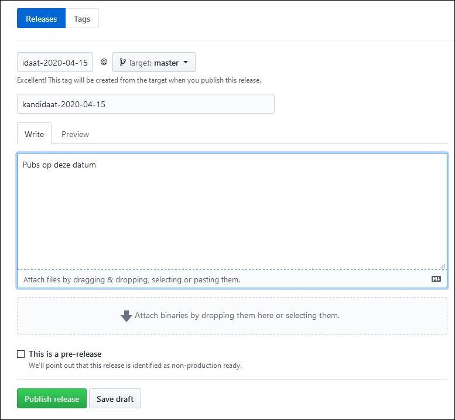
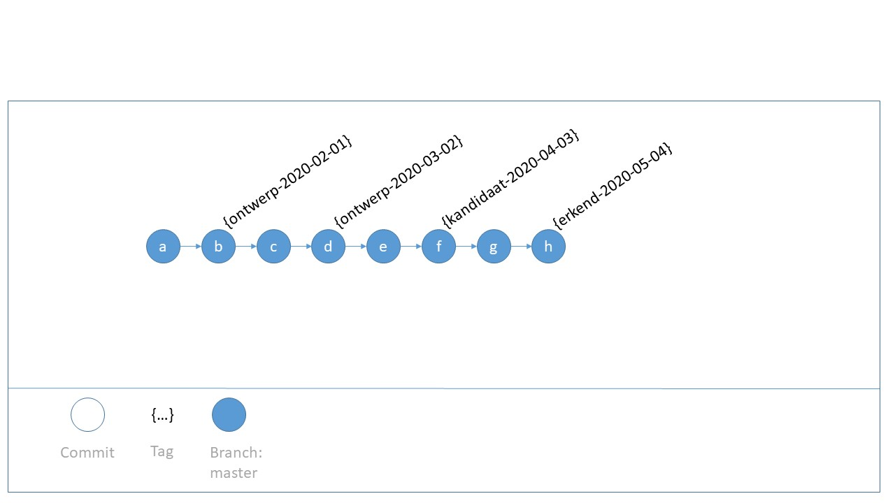
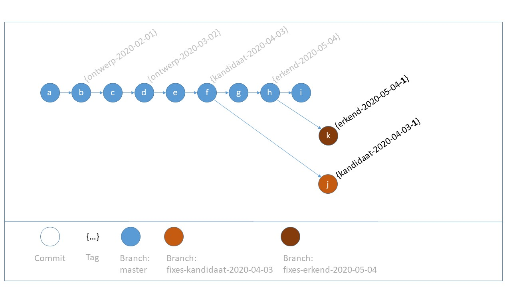
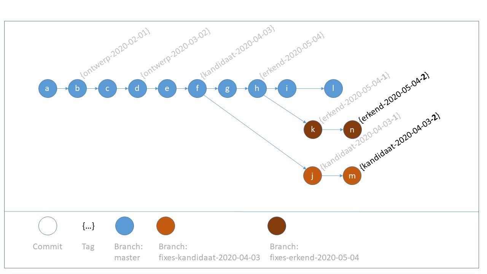

# Versiecontrole in de OSLO thema repository

## Inleiding

De levensloop van een OSLO specificatie doorloopt enkele statussen zoals bepaald in deze [status codelijst](https://data.vlaanderen.be/doc/conceptscheme/StandaardStatus).

Elke publicatie van een specificatie is overigens verbonden aan een bepaalde toestand van de bronbestanden, die zich in de OSLO thema repository bevinden.
De sectie [Tags](#tags) hieronder documenteert een eenduidige manier om deze commits gemakkelijk herkenbaar te identificeren.

Normaal gezien volgen publicatiepunten elkaar in chronologische volgorde op.
De sectie [Branches](#branches) hieronder voorziet in oplossingen ook voor als dit niet het geval zou zijn.

De sectie [Praktische voorbeelden](#praktische-voorbeelden) illustreert de vooropgezette principes.

## Typografische afspraken op deze pagina

| Vorm | Betekenis |
|------|-----------|
| `[]` | een optionele term |
| `{}` | een variabele term |

## Tags


Om publicaties te allen tijde te kunnen reconstrueren is het van belang die commit uniek te kunnen identificeren.
Dat kan in principe door de *commit hash* te gebruiken, maar dat is niet echt transparant.
Beter is om expliciet een **tag** toe te kennen, volgens een afgesproken naamgeving, zodat het verband publicatie vs. tag onmiddellijk afleesbaar is.


Principe: **_ken één tag toe per publicatiepunt_**.

Naamgeving voor tags:
```
[{documentMnemonic}-]{statusMnemonic}-{datum}[-{suffix}]
```

waarin:

| Veld | Beschrijving | Formaat |
|------|--------------|---------|
| `{documentMnemonic}` | Optionele term, enkel nodig als niet alle documenten in de repo tegelijk een nieuw publicatiepunt moeten krijgen. | camelCase, startend met kleine letter, alleen alfanumerische tekens |
| `{statusMnemonic}` | Afkorting voor de status waarin het document zich bevindt op het ogenblik van publicatie | zie volgende tabel |
| `{datum}` | Officiële publicatiedatum | xsd:date (YYYY-MM-DD) |
| `{suffix}` | Optionele term, enkel nodig als voor dezelfde publicatiedatum een correctie nodig is | integer: 1, 2, ... | 

statusMnemonic:

| status | {statusMnemonic} |
|--------|------------------|
| Ontwerp Standaard | `ontwerp` |
| Kandidaat Standaard | `kandidaat` |
| Erkende Standaard | `erkend` |
| Vervangen Standaard | `vervangen` |
| Verouderde Standaard | `verouderd` |
| Herroepen Standaard  | `herroepen` |

### Voorbeelden
- `ontwerp-2020-02-26`: bron voor publicatie op 2020-02-26 als Ontwerp Standaard van alle documenten (bijvoorbeeld een vocabularium en een applicatieprofiel) in een OSLO thema repository
- `kandidaat-2020-03-31`: bron voor publicatie op 2020-03-31 als Kandidaat Standaard van alle documenten (bijvoorbeeld een vocabularium en een applicatieprofiel) in een OSLO thema repository
- `kandidaat-2020-03-31-1`: zoals hierboven, nadat de volgende dag een typo werd gecorrigeerd
- `apPerceel-erkend-2020-04-30`: bron voor publicatie op 2020-04-30 als Erkende Standaard, enkel voor het applicatieprofiel Perceel

## Praktisch
Op github maak je op een eenvoudige manier een tag aan door een *release* aan te maken. Kies dezelfde naam voor release en tag.

Voorbeeld:




## Branches

Normaal gezien zijn opeenvolgende statussen van een OSLO specificatie Ontwerp Standaard, Kandidaat Standaard, Erkende Standaard, ... eventueel gevolgd door een nieuwe cylus Ontwerp Standaard, ...
Als de opeenvolgende publicaties in chronologische volgorde gebeuren, is geen nood aan branches.
Alles kan gedaan worden met opeenvolgende wijzigingen op één enkele branch, de **master** branch.

Er zijn nochtans omstandigheden waarin het gebruik van een **extra branch** gewenst of nodig is:

- Editors kunnen desgewenst zonder de ontwikkelingen op de master branch te storen, bepaalde experimenten of alternatieven uitwerken op elke willekeurige branch.
Deze kan later eventueel teruggemergd worden naar de master branch.
Hierbij dient opgemerkt te worden dat de cruciale Enterprise Architect modelbestanden binaire bestanden zijn, die niet kunnen gemerged worden.
- Het moet mogelijk zijn om aan een publicatie die ondertussen niet meer de laatste versie is op de `master` branch,
kleine editoriale wijzigingen of 'fixes' te doen.
Dit wordt behandeld in sectie [Branches in geval van fixes](#branches-in-geval-van-fixes), waar ook een specifieke naamgeving wordt voorop gezet. 

Algemene adviezen:
- **Tenzij anders nodig, werk op de master branch.**
- **Voor willekeurige branches, gebruik een afwijkende naamgeving ten opzichte van branches voor fixes. Documenteer deze branches in de README.md onder de root van de thema repository en op de master branch.**


### Branches in geval van fixes

Enkele voorbeelden van fixes:
- Een specificatie werd gepubliceerd als Erkende Standaard. Nadien is men verder aan het werken aan de bronbestanden op de `master` branch, tijdens een nieuwe ontwerp fase. Plots blijkt een editoriale wijziging (bijvoorbeeld om een typo te corrigeren) nodig aan de Erkende Standaard.
- Door een wijziging in de publicatieomgeving (bijvoorbeeld een niet-compatibele verandering in de toolchain) is het nodig updates te doen aan de bronbestanden in alle versies corresponderend met een publicatie die online staat.

Maak in dit geval een branch aan vertrekkend uit de tag verbonden aan de oorspronkelijke publicatie en maak in de branch naam duidelijk vanaf welke tag werd vertrokken.

Naamgeving:
```
fixes-{tagNaam}
```

waarin:

| Veld | Beschrijving |
|------|--------------|
| `{tagNaam}` | Naam van de tag waaruit de branch vertrekt. |

Voorbeeld
- `fixes-kandidaat-2020-03-31`: branch waarop een of meerdere fixes werden gedaan aan de publicatie verbonden aan tag `kandidaat-2020-03-31`.

## Praktische voorbeelden

In de volgende voorbeelden is de volgorde van commits in de tijd alfabetisch voorgesteld.

### Voorbeeld 1: publicaties in chronologische volgorde

In figuur 1 bevinden zich alle commits op de master branch. Commits **b**, **d**, **f** en **h** kregen een tag die gebruikt wordt in de configuratie van de respectievelijke publicatie in de centrale repository.



*Figuur 1*

### Voorbeeld 2 : fixes

Figuur 2 illustreert volgend scenario:
op een tijdstip na de erkenning van een standaard blijkt een editoriale wijzing nodig aan de gepubliceerde Kandidaat Standaard van 2020-04-03 en ook aan de gepubliceerde Erkende Standaard van 2020-05-04.

Voor de Kandidaat Standaard is een branch nodig, omdat de versie met tag *kandidaat-2020-04-03* niet meer de laatste is op de master branch.
Hiervoor wordt de branch **fixes-kandidaat-2020-04-03** in het leven geroepen en commit **j** krijgt een tag **kandidaat-2020-04-03-1**.
De configuratie van de publicatie van deze Kandidaat Standaard in de centrale repository wordt aangepast, zodat ze naar deze nieuwe tag verwijst.

Een gelijkaardige redenering geldt voor de getoonde Erkende Standaard. Merk op dat, mocht commit **i** niet hebben bestaan, er in dit geval nog geen nieuwe branch nodig zou geweest zijn.



*Figuur 2*

Figuur 3 toont een volgende reeks van editoriale wijzigingen (commits **m** en **n**).
Het is niet nodig om, eens een fixes branch bestaat, er nog een nieuwe in het leven te roepen voor volgende fixes aan dezelfde publicatie.



*Figuur 3*


